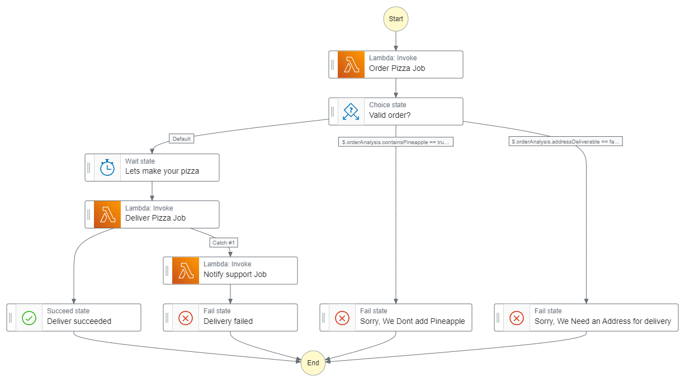
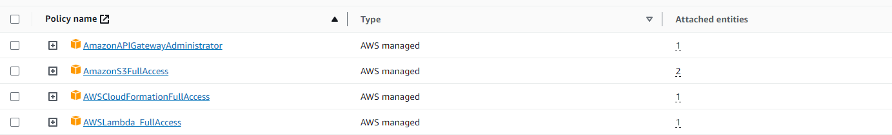
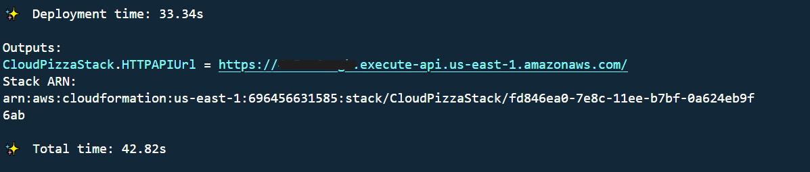

# Tactacam Cloud Pizza

This is a simple CDK stack to deploy the `Tactacam Cloud Pizza` service using AWS Step Functions and the state machine pattern from https://www.jeremydaly.com/serverless-microservice-patterns-for-aws/#statemachine

The `Tactacam Cloud Pizza`stack deploys an HTTP API Gateway along with Step Functions that orchestrate the start to preparate and deliver process once an pizza order is requested.

The Cloud Pizza State machine flow diagram



## Requirements
* `AWS CLI` v2 or latest version [install guide](https://docs.aws.amazon.com/cli/latest/userguide/getting-started-install.html)
* Node.js 18.x or latest LTS version [download](https://nodejs.org/en/download)

## AWS Account Setup
* Using AWS CLI, proceed to configure AWS CLI with an user account.
* **`If your user account have full administrator access to the AWS account`**, Skip to [Useful Commands](#useful-commands)
* Add the following `AWS managed` permissions to your user

* Also add the following custom policy permissions
 and 

This can be done on the AWS console following the [doc](https://docs.aws.amazon.com/IAM/latest/UserGuide/id_users_change-permissions.html).


## Useful commands

 * `npm run build`   compile typescript to js
 * `npm run bootstrap`   provision resources for the AWS CDK before you can deploy AWS CDK apps
 * `npm run watch`   watch for changes and compile
 * `npm run test`    perform the jest unit tests
 * `npm run deploy`  deploy this stack to your default AWS account/region
 * `npm run destroy` Deletes the CloudPizzaStack and all the resources
 * `cdk diff`        compare deployed stack with current state
 * `cdk synth`       emits the synthesized CloudFormation template

## Steps to deploy
 1. `npm run bootstrap`
 2. `npm run build`
 3. `npm run deploy`


### Testing It Out

After running the `npm run deploy` command you should see an the API URL `CloudPizzaStack.HTTPAPIUrl`, similar like the following screenshot:



For a successful execution run on the terminal replacing the `{HTTPAPIUrl}` with your `CloudPizzaStack.HTTPAPIUrl` url first.
```bash
curl --header "Content-Type: application/json" --request POST --data '{"flavour": "pepperoni", "address": "My delivery address"}' {HTTPAPIUrl}
```

For a failed execution run on the terminal replacing the `{HTTPAPIUrl}` with your `CloudPizzaStack.HTTPAPIUrl` url first.

### Case 1: Invalid pizza flavour
Flavour: "hawaiian" or "pineapple"
```bash
curl --header "Content-Type: application/json" --request POST --data '{"flavour": "hawaiian", "address": "My delivery address"}' {HTTPAPIUrl}
```
### Case 2: Invalid address
Don't include address field
```bash
curl --header "Content-Type: application/json" --request POST --data '{"flavour": "pepperoni"}' {HTTPAPIUrl}
```

The responses returned are the raw and full output from the step function so will look something like this:

```json
// A successful execution, note the "status" of SUCCEEDED and the "output" json string object field
{
    "billingDetails": {
        "billedDurationInMilliseconds": 2100,
        "billedMemoryUsedInMB": 64
    },
    "executionArn": "arn:aws:states:us-east-1:696456631585:express:PizzaStateMachine34092D67-ReDM6Z2WuOIe:fef3251e-a2be-4d88-a950-147370eb100f:a0b8c71e-b430-482a-bea3-3b09c0865c1c",
    "input": "{\"flavour\": \"pepperoni\", \"address\": \"My delivery address\"}",
    "inputDetails": {
        "__type": "com.amazonaws.swf.base.model#CloudWatchEventsExecutionDataDetails",
        "included": true
    },
    "name": "fef3251e-a2be-4d88-a950-147370eb100f",
    "output": "{\"flavour\":\"pepperoni\",\"address\":\"My delivery address\",\"orderAnalysis\":{\"containsPineapple\":false,\"addressDeliverable\":true},\"deliveryResult\":{\"status\":\"Delivering\",\"estimateDuration\":\"25 to 35 minutes\"}}",
    "outputDetails": {
        "__type": "com.amazonaws.swf.base.model#CloudWatchEventsExecutionDataDetails",
        "included": true
    },
    "startDate": 1.699578952094E9,
    "stateMachineArn": "arn:aws:states:us-east-1:696456631585:stateMachine:PizzaStateMachine34092D67-ReDM6Z2WuOIe",
    "status": "SUCCEEDED",
    "stopDate": 1.69957895419E9,
    "traceHeader": "Root=1-654d8448-df5ccbf6db237b18e8062cbd;Sampled=1"
}

// a failed execution, note the status: FAILED and the cause/error properties
{
    "billingDetails": {
        "billedDurationInMilliseconds": 200,
        "billedMemoryUsedInMB": 64
    },
    "cause": "They asked for Pineapple",
    "error": "Failed To Make Pizza",
    "executionArn": "arn:aws:states:us-east-1:696456631585:express:PizzaStateMachine34092D67-ReDM6Z2WuOIe:d5cdbdeb-4488-4647-b5cc-fc5852806c05:ab2473ad-43a1-4b6c-a79c-a83fb210b9b8",
    "input":"{\"flavour\": \"hawaiian\", \"address\": \"My delivery address\"}",
    "inputDetails": {
        "__type": "com.amazonaws.swf.base.model#CloudWatchEventsExecutionDataDetails",
        "included": true
    },
    "name": "d5cdbdeb-4488-4647-b5cc-fc5852806c05",
    "outputDetails": {
        "__type": "com.amazonaws.swf.base.model#CloudWatchEventsExecutionDataDetails",
        "included": true
    },
    "startDate": 1.699579039858E9,
    "stateMachineArn": "arn:aws:states:us-east-1:696456631585:stateMachine:PizzaStateMachine34092D67-ReDM6Z2WuOIe",
    "status": "FAILED",
    "stopDate": 1.699579040026E9,
    "traceHeader": "Root=1-654d849f-9a078245a9a46cedd4455b48;Sampled=1"
}
```

## Cleanup

1. Make sure you delete the `CloudPizzaStack` by running `npm run destroy`
2. And also go to the [Cloudformation console](https://us-east-1.console.aws.amazon.com/cloudformation/home) and manually delete `CDKToolkit` stack